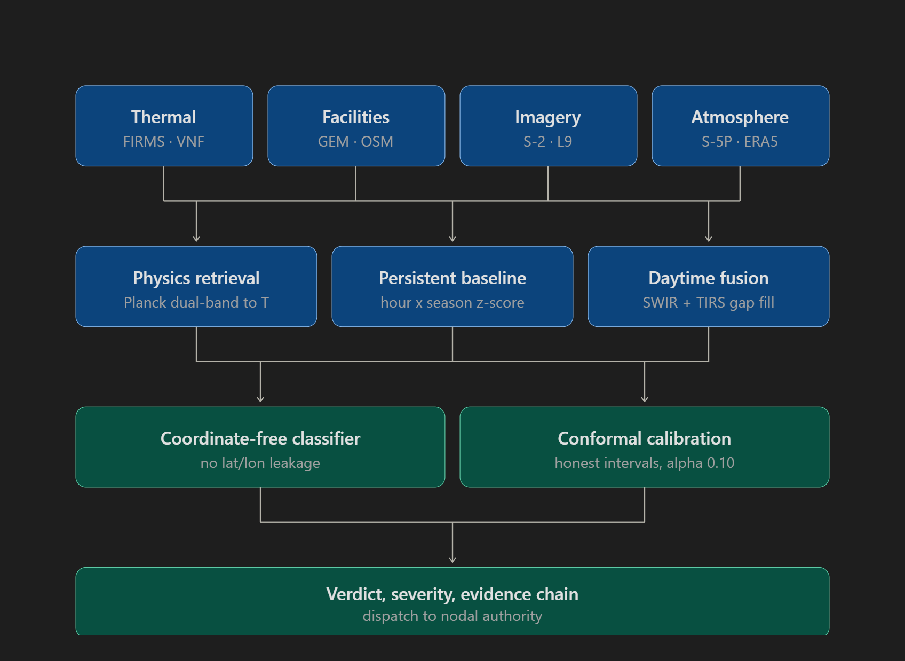
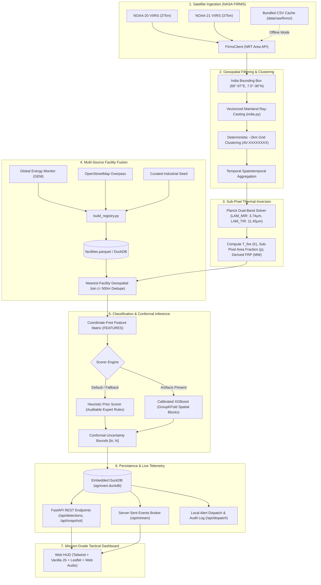
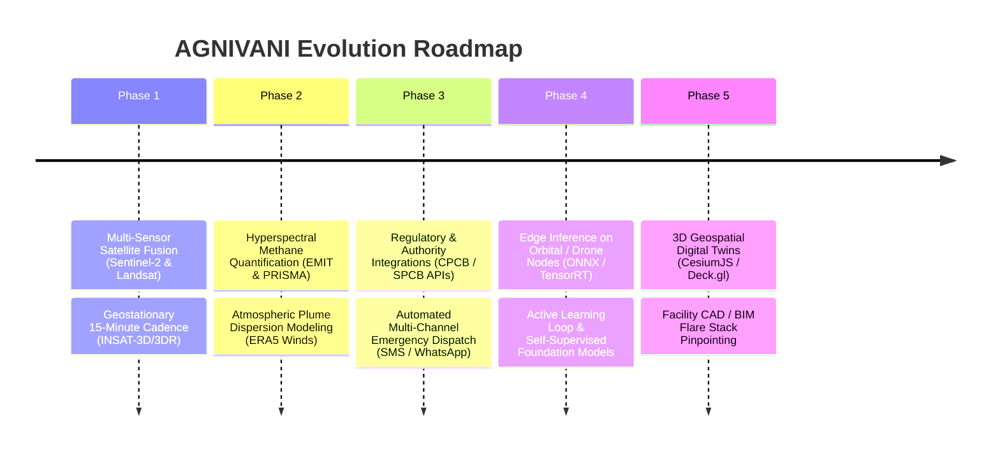

# AGNIVANI (अग्निवानी) — Industrial Thermal Anomaly Intelligence Grid
### *High-Cadence Satellite Earth Observation, Planck Physical Inversion & Automated Alert Dispatch*
**Smart India Hackathon (SIH 2026) | Problem Statement: PS 26162**

---



[](https://www.python.org/)
[](https://fastapi.tiangolo.com/)
[](https://duckdb.org/)
[](https://geopandas.org/)
[](https://xgboost.readthedocs.io/)
[](https://leafletjs.com/)
[](https://tailwindcss.com/)
[](https://www.sih.gov.in/)

---

## 📑 Table of Contents
1. [Executive Summary & Problem Statement](#-executive-summary--problem-statement)
2. [End-to-End System Architecture](#-end-to-end-system-architecture)
3. [Existing Features & Capabilities](#-existing-features--capabilities)
   - [1. Satellite Ingestion & Data Pipeline](#1-satellite-ingestion--data-pipeline)
   - [2. Geospatial Processing, Mainland Filtering & Diurnal Signatures](#2-geospatial-processing--mainland-filtering)
   - [3. Sub-Pixel Planck Inversion & Emissions Proxy](#3-sub-pixel-planck--dozier-physical-inversion--emissions-proxy)
   - [4. Multi-Source Industrial Registry & Synthetic Generation](#4-multi-source-industrial-registry-negative-controls--synthetic-generation)
   - [5. Leakage-Safe Classification & Grounded Decision Narratives](#5-leakage-safe-classification-conformal-inference--decision-narratives)
   - [6. Thread-Safe Analytical Storage & Event Engine](#6-thread-safe-analytical-storage--event-engine)
   - [7. Tactical Mission-Grade Web Dashboard & Fail-Loud Resilience](#7-tactical-mission-grade-web-dashboard)
4. [UI Module Showcase](#-ui-module-showcase)
5. [Repository Structure](#-repository-structure)
6. [Quickstart & Installation](#-quickstart--installation)
7. [Operational Workflows & CLI Commands](#-operational-workflows--cli-commands)
8. [REST API & SSE Specification](#-rest-api--sse-specification)
9. [Future Implementations & Roadmap](#-future-implementations--roadmap)
10. [Scientific Validation & Rigor](#-scientific-validation--rigor)
11. [Hackathon Credits & License](#-hackathon-credits--license)

---

## 🛰️ Executive Summary & Problem Statement

### The Problem (SIH 2026 — PS 26162)
Industrial complexes across India (refineries, petrochemical hubs, steel works, thermal power stations, and open-cast coal mines) continuously emit high-temperature thermal signatures. These range from routine **gas flaring** to catastrophic **uncontrolled fires**, **coal seam combustions**, and hazardous **fugitive emissions / unignited gas leaks**.

Conventional environmental monitoring relies either on sparse ground-based sensors or manual plant self-reporting, resulting in:
- **Delayed emergency responses** to major industrial explosions or runaway pipeline leaks.
- **Unmonitored greenhouse gas (GHG) and black carbon emissions** from illegal or excessive flaring.
- **High false-alarm rates** from agricultural residue burning (stubble burning) and seasonal wildfires misclassified as industrial events.

### The Solution: AGNIVANI
**AGNIVANI** (*अग्निवानी*) is an offline-first, physics-grounded, orbital thermal anomaly surveillance platform. It ingests near-real-time (NRT) satellite telemetry from NASA FIRMS VIIRS (NOAA-20 and NOAA-21 at 375m nadir resolution), executes automated dual-band Planck/Dozier sub-pixel radiometric inversions, associates hotspots with a multi-source registry of Indian industrial facilities, categorizes anomalies using a leak-free machine learning / heuristic pipeline, and streams mission-critical alerts to authorities with sub-minute latency.

---

## 🏛️ End-to-End System Architecture

The pipeline converts raw orbital radiance measurements into actionable industrial intelligence across six transparent verification stages:



---

## ⚡ Existing Features & Capabilities

### 1. Satellite Ingestion & Data Pipeline
- **Multi-Sensor Satellite Coverage**: Ingests NOAA-20 and NOAA-21 VIIRS 375m I-Band (`VIIRS_NOAA20_NRT`, `VIIRS_NOAA21_NRT`) datasets.
- **Robust Ingestion Engine (`FirmsClient`)**:
  - Automatically breaks multi-day queries into 5-day chunks to strictly satisfy the NASA FIRMS REST API constraints.
  - Resilience through Tenacity with exponential backoff (`stop_after_attempt(5)`, `wait_exponential`).
  - Resumable raw data storage under `data/raw/firms/`.
- **Air-Gapped / Offline First Mode**: Runs completely offline without any internet connection using pre-packaged FIRMS data (`firms_india.csv`), guaranteeing reliable presentation during hackathons and air-gapped deployments.
- **Live Background Scheduler**: Asynchronous polling loop (`scheduler_loop`) with configurable interval (default: 600s) and startup backfill (default: 90 days).

### 2. Geospatial Processing & Mainland Filtering
- **Vectorized Mainland Point-in-Polygon Filter (`agnivani/geo/india.py`)**:
  - High-precision polygonal boundary contour representing the sovereign mainland of India.
  - Automatically purges ocean noise, maritime flaring outside sovereign zones, and foreign neighboring emissions (e.g., Sri Lanka) using Shapely 2.0 `contains_xy`.
- **Deterministic Spatial Clustering (`agnivani/geo/cluster.py`)**:
  - Groups raw pixel hits into ~2 km discrete geographic cells (`CELL_DEG = 0.02`).
  - Stable MD5 cryptographic cluster identifiers (`AV-XXXXXXXX`).
  - Tracks spatiotemporal attributes: total hits (`n_hits`), distinct active days (`n_days`), night detection count (`n_nights`), day/night ratio (`night_frac`), temporal span (`span_days`), recurrence gaps (`recurrence_gap_days`), cluster physical extent (`cluster_extent_m`), and flare scores.
- **24-Hour Diurnal Solar Histograms & Temporal Signatures**:
  - Decomposes cluster detection timestamps into a 24-bin normalized histogram across local solar hours (`diurnal_hist`, sums to 1.0).
  - Classifies temporal emission shapes into canonical physical signatures (`diurnal_shape`):
    - `FLAT_24H`: Continuous 24/7 industrial flaring, kilns, or smelters (high night fraction, low entropy).
    - `SPIKE_DECAY`: Abrupt emergency explosion or structural fire event.
    - `EVENING_BURST`: Concentrated agricultural stubble burning (mass concentrated between 16:00–20:00 local solar time).
    - `DAYTIME_ONLY`: Peak diurnal solar wildfire behavior (mass concentrated between 10:00–16:00 local solar time).
    - `SPARSE`: Low-frequency or single-detection events.

### 3. Sub-Pixel Planck / Dozier Physical Inversion & Emissions Proxy
- **Dual-Band Dozier Algorithm (`agnivani/physics/planck.py`)**:
  - Formulates and solves non-linear Planck blackbody radiation equations over two infrared channels:
    $$\lambda_{\text{MIR}} = 3.74\,\mu\text{m} \quad (\text{Band } I4), \qquad \lambda_{\text{TIR}} = 11.45\,\mu\text{m} \quad (\text{Band } I5)$$
  - Uses Brent's root-finding method (`scipy.optimize.brentq`) to solve:
    $$g(T) = \left(L_4 - B_4(T_b)\right)\left(B_5(T) - B_5(T_b)\right) - \left(L_5 - B_5(T_b)\right)\left(B_4(T) - B_4(T_b)\right) = 0$$
  - Solves simultaneously for:
    - **$T_{\text{fire}}$**: Sub-pixel emitter kinetic temperature (Kelvin).
    - **$p$**: Sub-pixel emitter area fraction ($0 < p \le 1$).
    - **$\text{FRP}_{\text{derived}}$**: Derived Fire Radiative Power (MW) calculated via the Stefan-Boltzmann equation ($\sigma \cdot p \cdot A_{\text{pixel}} \cdot T^4$).
- **Radiative Emissions Proxy ($CO_2e$ & Black Carbon Tracking)**:
  - Couples retrieved FRP ($MW$) with published sector-specific radiative emission factors (Akagi et al., IPCC, CPCB flare conversion constants):
    - **$CO_2e$ Rate**: Measured in tonnes per hour ($\text{t/h}$).
    - **Black Carbon Rate**: Measured in kilograms per hour ($\text{kg/h}$).
    - **Cumulative $CO_2e$**: Estimated total tonnage emitted across the cluster's active temporal span.
  - **Marine / Offshore Suppression**: Hotspots over open ocean without associated offshore oil/gas infrastructure are flagged (`offshore_suppressed = true`), assigning zero terrestrial emission credit to eliminate phantom maritime pollution.
- **Honest Physical Failure Modes**:
  - Distinguishes physical non-convergences: `NO_MIR_EXCESS` (no hot-source elevation over background), `NO_ROOT` (mixed-pixel saturation without root), and `P_CLIPPED` (sub-pixel area fraction exceeds unity).

### 4. Multi-Source Industrial Registry, Negative Controls & Synthetic Generation
- **Comprehensive Facility Coverage (`data/processed/facilities.parquet`)**:
  - Curated and programmatically merged database covering Indian Refineries, LNG terminals, Petrochemicals, Steel plants, Thermal Power stations, Coalfields, Cement, and Fertilizers.
  - Automated integration from **GEM (Global Energy Monitor)**, **OSM (OpenStreetMap)**, and manual seeds.
  - Spatial deduplication within 500 meters using Haversine formulas.
- **Negative Control Generation (`sample_negative_controls`)**:
  - Automated generation of hard negative controls (8–25 km away from known industrial facilities) for training robust background classifiers.
- **Physics-Informed Synthetic Hotspot Generator (`generate_synthetic_blobs`)**:
  - Synthesizes realistic thermal clusters whose physical features match facility sector thermodynamics (`FLARE`/`REFI_GAS`, `COAL`, `IND_FIRE`, `WILD`, `LEAK`) for leak-free model training, stress testing, and offline benchmarking.
- **Registry Gap Analysis (`data/processed/registry_gaps.parquet`)**:
  - Automatically identifies persistent, intense thermal emitters located $>50\,\text{km}$ away from any registered industrial facility, surfacing unregistered/clandestine industrial operations.

### 5. Leakage-Safe Classification, Conformal Inference & Decision Narratives
- **5-Class Thermal Anomaly Taxonomy**:
  1. `FLARE`: Gas flaring at refineries, petrochemical complexes, and offshore/onshore platforms.
  2. `IND_FIRE`: High-temperature structural or industrial process fires.
  3. `COAL`: Slow-combusting, low-temperature, spatially extended coal seam fires.
  4. `WILD`: Agricultural crop residue burning (stubble) or forest wildfires.
  5. `LEAK`: Fugitive emissions or unignited gas leaks (characterized by proximity to gas/refinery infrastructure without MIR excess).
- **Leak-Free ML Engineering (`agnivani/features/build.py`)**:
  - Strictly bans raw spatial coordinates (`lat`, `lon`, `centroid_lat`, `centroid_lon`, `block_id`, etc.) from model training to prevent geographic memorization.
  - Leverages 23+ physical & contextual features: $T_{\text{fire}}$, sub-pixel area fraction, $\Delta T$ ($I4 - I5$), radiance ratios, $\log(1 + \text{FRP})$, cyclic solar hour ($\sin / \cos$), diurnal shape, night fraction, temporal recurrence gap, facility distance, and landcover classification.
- **Dual Scorer Architecture**:
  - **Heuristic Prior Scorer** (Default): Transparent, fully auditable rule-based expert prior model reporting hand-set prior distributions with zero cold-start dependencies.
  - **Calibrated XGBoost Scorer**: Multi-class gradient boosted trees evaluated using `GroupKFold` spatial-block cross-validation (`GroupKFold` on $2^\circ \times 2^\circ$ spatial grid cells) to ensure generalization to unseen regions.
- **Conformal Prediction**: Outputs valid confidence intervals $[lo, hi]$ around predicted probabilities, providing operators with statistical bounds on uncertainty.
- **Explainable Decision Narrative & Anti-Hallucination Guard (`agnivani/narrative/reason.py`)**:
  - Synthesizes a grounded, single-sentence decision narrative explaining classification, confidence, the two strongest physical evidences, and statutory rule implications.
  - Supports local/remote LLM execution (`auto`, `ollama`, `openai`, `anthropic`) with an instant deterministic template fallback for offline operation.
  - Cites applicable Indian regulations: `CPCB-FLARE-PERMIT`, `NDMA-INDUSTRIAL-SAFETY`, `DGMS-COAL-FIRE`, `PNGRB-GAS-LEAK`, `CPCB-AGRICULTURAL-BURN`, and `MOEFCC-FOREST-FIRE`.
  - **Strict Anti-Hallucination Guard**: Regex numerical scanner (`validate_no_hallucinated_numbers`) rejecting any generated explanation containing numeric tokens ungrounded in the physical evidence dictionary.

### 6. Thread-Safe Analytical Storage & Event Engine
- **Embedded DuckDB Engine (`agnivani/store/duck.py`)**:
  - High-performance, thread-safe embedded SQL engine storing all detections, facilities, alerts, and operational logs.
  - Direct zero-copy Parquet integration through analytical views (`v_detections`, `v_sources`, `v_facilities`, `v_labelled`).
- **Real-Time Pub/Sub Broker (`agnivani/api/events.py`)**:
  - In-memory asynchronous pub/sub broker distributing live satellite detections and pipeline execution metrics to connected clients over Server-Sent Events (`/api/stream`).
- **Real Stage Latency Benchmarking (`perf_counter`)**:
  - Execution-level telemetry tracking real elapsed time in milliseconds across all six verification pipeline stages (`VIIRS INGEST`, `INDIA FILTER`, `SOURCE CLUSTER`, `PLANCK RETRIEVAL`, `REGISTRY JOIN`, `CLASSIFY`).

### 7. Tactical Mission-Grade Web Dashboard
- **Mission Control Center (`index.html#mission-control`)**:
  - Real-time animated **Live Alert Feed** displaying recent thermal triggers with emissions rates.
  - Dual Map Visualization:
    - **Vector Radar Mode**: Custom HTML5 Canvas rendering a simulated orbital sweep, range rings, coordinate grids, and pulsing thermal hotspots.
    - **Satellite Mode**: Interactive Leaflet.js map with CartoDB Dark Matter tiles, custom SVG markers, dynamic clustering, and facility pins.
  - **Optical vs. Infrared Swipe Comparison**: Interactive before/after split slider comparing high-resolution optical imagery with SWIR/MWIR thermal false-color layers for the selected anomaly.
  - **Live Terminal & Telemetry Bar**: Shows satellite orbit status, NOAA-20 overpass counter, coordinates, and real-time execution logs.
  - **Decision Narrative & Why Chips**: Displays the generated single-sentence regulatory narrative, statutory badge (`cited_rule`), and dynamic ranking chips for top contributing physical features.
  - **Diurnal Signature Sparkline**: 24-bin micro-histogram rendered in the inspection panel showing solar hour distribution.
  - **Sentinel-2 (S2) Tasking Telemetry**: Automated generator preparing SWIR Band 11 (1.610 µm) & Band 12 (2.190 µm) high-resolution optical tasking scripts.
- **Fail-Loud Resilience & Offline Caching**:
  - Caches `/api/snapshot` payloads in browser `localStorage` (`agnivani_snapshot_cache`).
  - On network timeout or backend disruption, displays a visible, high-priority `"LIVE BACKEND UNREACHABLE — using cached snapshot"` banner with a pulsing indicator and `"RETRY SYNC"` button.
  - Strictly restricts synthetic simulation loops behind an explicit `?demo=1` flag for offline rehearsals, preventing random blips in operational environments.
- **Alerts Queue Module (`index.html#alerts`)**:
  - Enterprise alert management table with filtering by severity (`CRITICAL`, `HIGH`, `MODERATE`, `LOW`), classification, and operational status (`NEW`, `DISPATCHED`, `RECEIVED`, `RESPONDED`).
  - Multi-channel dispatch status tracking (SMS, Email, API Webhook, Mock).
- **Telemetry & Insights Analytics (`index.html#analytics`)**:
  - High-level KPIs: Total Detections, Active Persistent Sources, Critical Anomalies, Mean FRP, and **Estimated Emissions Rate ($CO_2e$ t/h)**.
  - Sector-wise thermal emission breakdown (Refineries, Steel, Coal, Cement, Fertilizer).
  - FRP vs. Temperature physical correlation scatter metrics.
  - Diurnal solar hour distribution analysis ($\sin/\cos$).
- **Detection Dossier Module (`index.html#dossier`)**:
  - Forensic audit of any selected anomaly.
  - **6-Stage Verification Breadcrumb Trail**: Visual status cards for VIIRS Ingest, India Filter, Source Cluster, Planck Retrieval, Registry Join, and Classify with real millisecond deltas.
  - **Planck Spectral Radiance Curve**: Interactive visual comparison of spectral radiance $L_\lambda$ across wavelengths ($\lambda_{\text{MIR}}$ vs $\lambda_{\text{TIR}}$) comparing background ambient emission against anomalous fire Planck curves.
  - **Conformal Uncertainty Display**: Visual confidence bar with lower and upper confidence bounds.
  - **Feature Attribution Ranking**: Visual contribution breakdown of top contributing features (temperature, night fraction, facility distance).
- **Facility Profile Module (`index.html#facility`)**:
  - Dedicated facility view (e.g., Jamnagar Refinery, Hazira, Vadinar, Panipat, Bokaro).
  - Historical thermal baselines, flare recurrence statistics, and geographic perimeter overview.
- **Procedural Web Audio HUD**:
  - Web Audio API synthesizer generating tactical sound effects (sonar radar blip, critical warning siren, alert dispatch confirmation chime) with mute toggle.

---

## 🖥️ UI Module Showcase

| Module | Interface Preview | Description |
| :--- | :--- | :--- |
| **Mission Control** | `stitch_agnivani_thermal_intelligence_grid/agnivani_mission_control/screen.png` | Primary tactical console with live alert feed, radar/satellite maps, optical vs. infrared swipe slider, and physical inversion telemetry. |
| **Alert Console** | `stitch_agnivani_thermal_intelligence_grid/agnivani_alert_console/screen.png` | Operational alert triage desk with severity-based filtering, authority routing, and multi-channel dispatch execution. |
| **Detection Dossier** | `stitch_agnivani_thermal_intelligence_grid/agnivani_detection_dossier/screen.png` | Forensic drilldown displaying the 6-stage evidence chain, Planck radiation curves, conformal prediction intervals, and SHAP-style feature contributions. |
| **Analytics & Insights** | `stitch_agnivani_thermal_intelligence_grid/agnivani_analytics_insights/screen.png` | Macro-level statistical intelligence: sector distributions, temperature histograms, diurnal flaring patterns, and emission trends. |
| **Facility Profile** | `stitch_agnivani_thermal_intelligence_grid/agnivani_facility_profile/screen.png` | Deep profile of registered industrial assets detailing historical flaring intensity, baseline deviations, and perimeter coordinates. |

*(All design systems and UI screen captures are available under [`stitch_agnivani_thermal_intelligence_grid/`](stitch_agnivani_thermal_intelligence_grid/)).*

---

## 📂 Repository Structure

```
26162-SIH hackathon PS/
├── AGNIVANI_data_pipeline_for_PS_26162.png   # Architectural pipeline diagram
├── README.md                                 # Comprehensive system documentation
├── requirements.txt                          # Python dependencies with pinned versions
├── .env.example                              # Environment configuration template
├── firms_profile.py                          # Standalone VIIRS profiler & polygon validator
├── index.html                                # Main mission-grade tactical dashboard
├── alerts.html                               # Standalone redirect/deep-link to Alerts Queue
├── analytics.html                            # Standalone redirect/deep-link to Analytics
├── dossier.html                              # Standalone redirect/deep-link to Detection Dossier
├── facility.html                             # Standalone redirect/deep-link to Facility Profile
│
├── agnivani/                                 # Core Python backend package
│   ├── __init__.py                           # Package initialization
│   ├── config.py                             # Pydantic v2 settings & environment loader
│   ├── logging_setup.py                      # Structlog structured JSON/console logging
│   ├── main.py                               # FastAPI application, lifespan & static mounting
│   │
│   ├── api/                                  # API routing & wire contracts
│   │   ├── detections.py                     # GET /health, /detections, /stats, /facilities
│   │   ├── dispatch.py                       # POST /dispatch (local receipt & alert recording)
│   │   ├── events.py                         # In-memory async EventBroker (Pub/Sub)
│   │   ├── pipeline.py                       # GET /pipeline/log (pipeline execution telemetry)
│   │   ├── schemas.py                        # Pydantic wire schemas (DetectionOut, StatsOut, etc.)
│   │   ├── snapshot.py                       # GET /snapshot (single roundtrip dashboard hydration)
│   │   └── stream.py                         # GET /stream (Server-Sent Events with heartbeat)
│   │
│   ├── features/                             # Leakage-safe feature extraction
│   │   └── build.py                          # Feature matrix builder (bans lat/lon, creates block IDs)
│   │
│   ├── geo/                                  # Geospatial intelligence
│   │   ├── cluster.py                        # Deterministic ~2km grid clustering & flare scoring
│   │   ├── india.py                          # Mainland polygon ray-casting point-in-polygon filter
│   │   └── registry.py                       # Facility loader, nearest neighbor & negative controls
│   │
│   ├── ingest/                               # Satellite telemetry ingestion
│   │   ├── firms.py                          # NASA FIRMS Area API client with retry & normalisation
│   │   └── scheduler.py                      # Pipeline executor (ingest -> cluster -> physics -> score)
│   │
│   ├── models/                               # Inference & training
│   │   ├── evaluate.py                       # Spatial-block GroupKFold evaluation metrics
│   │   ├── scorer.py                         # Heuristic prior & Calibrated XGBoost scorers
│   │   └── train.py                          # Leak-free spatial-block model training pipeline
│   │
│   ├── narrative/                            # Regulatory narrative & anti-hallucination guard
│   │   ├── __init__.py                       # Package exports
│   │   └── reason.py                         # Multi-provider LLM/template reason generator & numerical guard
│   │
│   ├── physics/                              # Radiative transfer & thermal inversion
│   │   └── planck.py                         # Planck spectral radiance & dual-band Dozier solver
│   │
│   └── store/                                # Persistence layer
│       └── duck.py                           # Thread-safe DuckDB analytical storage
│
├── css/                                      # Stylesheets
│   └── styles.css                            # Tactical HUD design tokens, animations & scrollbars
├── js/                                       # Frontend application logic
│   └── app.js                                # Application state, Web Audio FX, Leaflet & SSE client
│
├── scripts/                                  # Utility & administration scripts
│   ├── build_registry.py                     # Multi-source registry builder (GEM + OSM)
│   ├── fetch_firms.py                        # Standalone script to fetch recent NASA FIRMS CSVs
│   └── train.py                              # Wrapper script to execute spatial-block ML training
│
├── data/                                     # Data storage (bundled & processed)
│   ├── agnivani.duckdb                       # DuckDB database file
│   ├── raw/                                  # Raw inputs
│   │   ├── firms/firms_india.csv             # Bundled real VIIRS observations for offline mode
│   │   ├── registry/                         # Raw facility CSVs
│   │   └── truth/                            # Ground-truth validation datasets
│   ├── processed/                            # Parquet analytical artifacts
│   │   ├── facilities.parquet                # Curated multi-source facility registry
│   │   ├── labelled.parquet                  # Ground-truth labelled dataset for training
│   │   └── registry_gaps.parquet             # Identified persistent clusters with no nearby facility
│   └── models/                               # Trained ML artifacts (model, calibrator, conformal)
│
├── stitch_agnivani_thermal_intelligence_grid/ # UI Design System, assets & screen mocks
└── tests/                                    # Automated Pytest test suite
    ├── test_api.py                           # API contract, CORS & live endpoint tests
    ├── test_features.py                      # Leak-free coordinate & feature matrix tests
    ├── test_india.py                         # Sovereign boundary point-in-polygon verification
    ├── test_live_integration.py              # Snapshot endpoint & config shim integration tests
    ├── test_planck.py                        # Planck inversion & Dozier convergence unit tests
    ├── test_registry.py                      # Registry deduplication, labelling & negative controls
    └── test_synth.py                         # Synthetic facility blobs & diurnal shape tests
```

---

## 🚀 Quickstart & Installation

### Prerequisites
- **Python**: Version 3.11 or higher
- **Git**
- Optional: NASA FIRMS Map Key (free registration at [FIRMS API Portal](https://firms.modaps.eosdis.nasa.gov/api/))

### 1. Clone the Repository
```bash
git clone https://github.com/developer-jenil/SIH26162.git
cd SIH26162
```

### 2. Set Up Virtual Environment & Dependencies
#### On Windows (PowerShell):
```powershell
python -m venv .venv
.venv\Scripts\Activate.ps1
pip install -r requirements.txt
```

#### On Linux / macOS:
```bash
python3 -m venv .venv
source .venv/bin/activate
pip install -r requirements.txt
```

### 3. Configure Environment Variables
Copy `.env.example` to `.env`:
```powershell
Copy-Item .env.example .env     # Windows PowerShell
# cp .env.example .env           # Linux / macOS
```

The default configuration is pre-tuned for an **instant, zero-friction offline demo**:
```env
# Core & Offline Mode
OFFLINE_MODE=true
FIRMS_MAP_KEY=
SCORER_BACKEND=heuristic
DATA_DIR=data
LOG_LEVEL=INFO
POLL_INTERVAL_SECONDS=600
BACKFILL_DAYS=90

# Explainable Regulatory Narrative LLM Provider (auto | ollama | openai | anthropic | template)
LLM_PROVIDER=auto
OLLAMA_URL=http://localhost:11434
OLLAMA_MODEL=llama3.2:1b
OPENAI_API_KEY=
ANTHROPIC_API_KEY=

# Environment & CORS Security (comma-separated origins)
AGNIVANI_ENV=development
CORS_ORIGINS=http://localhost:8000,http://127.0.0.1:8000,http://localhost:3000,http://localhost:5173
```

### 4. Run the Application
Launch the FastAPI development server:
```powershell
uvicorn agnivani.main:app --reload --host 0.0.0.0 --port 8000
```

### 5. Access the Platform
- **Tactical Dashboard**: Open your browser at [http://localhost:8000/](http://localhost:8000/)
- **Offline Rehearsal Mode**: Open [http://localhost:8000/?demo=1](http://localhost:8000/?demo=1) to activate embedded demonstration fixtures and synthetic anomaly generation.
- **Interactive OpenAPI Documentation**: Open [http://localhost:8000/docs](http://localhost:8000/docs)
- **Alternative ReDoc Docs**: Open [http://localhost:8000/redoc](http://localhost:8000/redoc)

> [!TIP]
> When `OFFLINE_MODE=true`, the system immediately loads bundled observations from `data/raw/firms/firms_india.csv` and executes the complete pipeline without requiring any API keys or network calls.

> [!NOTE]
> In production and live monitoring, synthetic anomalies are strictly suppressed to guarantee 100% telemetry authenticity. If the backend is unreachable, the dashboard automatically fails loud and presents cached historical observations from `localStorage`. Synthetic simulation is strictly restricted behind `?demo=1`.

---

## 🛠️ Operational Workflows & CLI Commands

### Run the Test Suite
Verify that the physics engine, geospatial boundaries, feature pipeline, and API contracts are fully passing:
```powershell
.venv\Scripts\python.exe -m pytest -q
```

### Test Spatial-Block Model Training (Dry-Run)
Inspect the leakage-free feature set and verify GroupKFold validation rules:
```powershell
python -m agnivani.models.train --dry-run
```

### Build or Update the Industrial Facility Registry
Fetch and merge data from GEM and OSM Overpass into `data/processed/facilities.parquet`:
```powershell
python -m scripts.build_registry
```

### Fetch Real-Time Satellite Passes (Online Mode)
To ingest live VIIRS satellite overpasses from NASA:
1. In `.env`, set `OFFLINE_MODE=false` and insert your 32-character key into `FIRMS_MAP_KEY`.
2. Run the fetcher script (resumable, max 5 days per pull):
```powershell
python -m scripts.fetch_firms --days 5
```

### Run Standalone Profile Analysis on Any FIRMS CSV
Profile any raw VIIRS CSV to filter non-India points, identify persistent hot cells, and score flaring patterns:
```powershell
python firms_profile.py firms_india.csv
```
This generates `<name>_clean.csv` (mainland filtered) and `<name>_persistent.csv` (scored cells).

---

## 🔌 REST API & SSE Specification

AGNIVANI exposes an OpenAPI-compliant REST API and real-time Server-Sent Events stream:

| Method | Endpoint | Description | Query / Body Parameters |
| :--- | :--- | :--- | :--- |
| `GET` | `/` | Web tactical dashboard with injected live API configuration shim. | None |
| `GET` | `/api/health` | Healthcheck returning backend status, active scorer metadata, and ingest age. | None |
| `GET` | `/api/snapshot` | **Single-call dashboard hydration** returning stats, detections, and facilities in one atomic payload with offline cache compatibility. | None |
| `GET` | `/api/detections` | Query filtered detections. | `bbox` (minx,miny,maxx,maxy), `hours` (default: 24), `cls` (repeatable), `min_conf` (0–1), `limit` (default: 500) |
| `GET` | `/api/detections/{id}` | Detailed forensic record for a specific anomaly ID. | `detection_id` (path parameter) |
| `GET` | `/api/stats` | High-level system statistics (counts by class, severity breakdown, scorer metadata). | None |
| `GET` | `/api/facilities` | List registered industrial facilities with spatial coordinates. | `sector` (`REFI_GAS`, `STEEL`, `COAL`, `POWER`, `CEMENT`, `FERTILIZER`) |
| `GET` | `/api/stream` | **Server-Sent Events (SSE)** stream delivering live `detection` and `ingest` events with 15s heartbeat. | None |
| `POST` | `/api/dispatch` | Dispatch alert to emergency authorities (stores receipt locally in JSONL and alerts table). | `{"detection_id": "...", "authority": "...", "channel": "sms"\|"email"\|"api"\|"mock", "note": "..."}` |
| `GET` | `/api/pipeline/log` | Operator-visible execution log showing 6-stage verification timing deltas in real milliseconds. | None |

### Key Detection Payload Schema (`DetectionOut`)
Every detection record returned by `/api/detections` and `/api/snapshot` incorporates physical, regulatory, and emissions telemetry:
- **`id` & Coordinates**: `id` (e.g. `AV-4D5F8A12`), `lat`, `lon`, `centroid_lat`, `centroid_lon`.
- **Classification & Uncertainty**: `cls` (`FLARE`, `IND_FIRE`, `COAL`, `WILD`, `LEAK`), `conf` (0.0–1.0), `lo` / `hi` (conformal bounds), `probs` (5-class normalized probability vector summing to $1.0$).
- **Thermal Radiative Inversion**: `t_fire_K` (sub-pixel kinetic temperature in Kelvin), `p_area` (sub-pixel area fraction), `frp_derived_MW` (Stefan-Boltzmann derived FRP), `frp_MW` (VIIRS observed FRP).
- **Emissions Proxy**: `co2e_rate_tph` (tonnes $CO_2e$/hr), `black_carbon_rate_kgph` (kg Black Carbon/hr), `co2e_total_t` (cumulative tonnes emitted), `offshore_suppressed` (boolean flag for ocean clusters without platforms).
- **Diurnal Signature**: `diurnal_shape` (`FLAT_24H`, `SPIKE_DECAY`, `EVENING_BURST`, `DAYTIME_ONLY`, `SPARSE`), `diurnal_hist` (24-bin normalized hourly histogram).
- **Explainable Decision Narrative**: `reason` (grounded single-sentence explanation), `reason_template` (deterministic fallback), `cited_rule` (statutory regulation machine tag, e.g. `CPCB-FLARE-PERMIT`).

---

## 🔮 Future Implementations & Roadmap

AGNIVANI has been architected from day one for seamless evolution into a comprehensive national environmental defense grid. The following enhancements represent the forward development trajectory:



### Phase 1: Multi-Constellation Satellite Fusion & High-Res Confirmation
- **Automated High-Resolution Tasking (Sentinel-2 & Landsat 8/9)**:
  - While VIIRS provides high temporal frequency (twice daily per satellite at 375m), higher spatial resolution is required for pin-point facility localization.
  - Implement automated triggers that ingest European Space Agency (ESA) **Sentinel-2 MSI (20m SWIR Bands 11 & 12)** and USGS **Landsat 8/9 OLI (30m SWIR)** to confirm flare stack vs. ground combustion.
- **Geostationary 15-Minute Cadence (INSAT-3D / INSAT-3DR & Himawari-9)**:
  - Ingest raw thermal imager bands from ISRO's INSAT-3D/3DR geostationary meteorological satellites to provide near-continuous (15–30 minute) thermal variation monitoring over the Indian subcontinent.

### Phase 2: Hyperspectral Methane & GHG Quantification
- **Methane Column Quantification (NASA EMIT, PRISMA & EnMAP)**:
  - Integrate imaging spectrometer data to detect the characteristic $2.3\,\mu\text{m}$ absorption band of methane ($CH_4$).
  - Quantify unignited fugitive releases and venting at offshore oil rigs and cross-country natural gas pipelines.
- **Gaussian Plume Dispersion & Emission Rate Inversion**:
  - Couple detected thermal and gas anomalies with real-time **ECMWF ERA5 / IMD atmospheric wind vector fields**.
  - Solve inverse atmospheric dispersion equations to estimate emission mass rates ($\text{kg/hr}$ of $CH_4$ and $\text{t/hr}$ of $CO_2$).

### Phase 3: Regulatory Compliance & Automated Dispatch Gateways
- **CPCB / SPCB Environmental Compliance Gateway**:
  - Direct integration with Central Pollution Control Board (CPCB) and State Pollution Control Boards (e.g., GPCB, MPCB) OCEMS (Online Continuous Emission Monitoring Systems) gateways.
  - Automated detection of statutory flaring violations during unauthorized night hours or during emergency pollution containment phases (e.g., GRAP in Delhi-NCR).
- **Automated Emergency Dispatch Service**:
  - Upgrade the current mock dispatch adapter to production-grade integrations via **Twilio / Gupshup SMS**, **WhatsApp Business API**, and automated incident tickets in government emergency management workflows (NDRF/SDMA).

### Phase 4: Edge AI & Continuous Learning (MLOps)
- **Edge Deployment (ONNX Runtime & TensorRT)**:
  - Package model inference into ultra-compact ONNX and TensorRT runtimes capable of running on forward-deployed micro-stations and aerial surveillance drones.
- **Active Learning & Human-in-the-Loop Validation**:
  - Incorporate a verification portal where ground inspectors and satellite analysts confirm or correct anomaly classifications.
  - Retrain the calibrated XGBoost model incrementally using validated records stored in `data/raw/truth/`.

### Phase 5: 3D Geospatial Digital Twins & Facility BIM
- **CesiumJS / deck.gl 3D Globe Integration**:
  - Upgrade the 2D Leaflet canvas into an interactive 3D terrain globe visualizing atmospheric heat plumes rising into the boundary layer.
- **Facility BIM / CAD Integration**:
  - Overlay 3D architectural models of mega-refineries (e.g., Jamnagar, Hazira) to isolate which specific flare stack, cracking unit, or storage tank is responsible for the thermal spike.

---

## 🔬 Scientific Validation & Rigor

### 1. Leakage-Free Spatial Machine Learning
A common error in satellite-based machine learning is training models on random train/test splits where spatial coordinates (`lat`, `lon`) are present as features. This leads to **spatial memorization**, where models achieve artificially high test scores simply by memorizing where refineries are located, but completely fail to generalize to new or unmapped sites.

**AGNIVANI's Defense**:
- Spatial coordinates are strictly excluded from the `FEATURES` matrix (`assert not (set(FEATURES) & FORBIDDEN)`).
- Model evaluation utilizes **`GroupKFold` on discrete spatial blocks** ($2^\circ \times 2^\circ$ grid cells). Detections within the same geographic cluster never leak across training and validation folds.

### 2. Physical Radiative Transfer Integrity
- Rather than treating satellite brightness temperature as a black-box machine learning input, AGNIVANI relies on the fundamental physics of the **Planck Blackbody Function**:
  $$B(\lambda, T) = \frac{C_1}{\lambda^5 \left(\exp\left(\frac{C_2}{\lambda T}\right) - 1\right)}$$
- The Dozier inversion computes the true sub-pixel fire temperature ($T_{\text{fire}} \approx 800\text{–}2000\,\text{K}$) and fractional pixel area ($p \approx 10^{-4}\text{–}10^{-2}$), accounting for the fact that hot sub-pixel targets dominate the MIR spectrum without significantly warming the bulk pixel.

---

## 👥 Hackathon Credits & License

- **Event**: Smart India Hackathon (SIH 2026)
- **Problem Statement**: PS 26162 — Industrial Thermal Anomaly Intelligence Grid
- **Team**: AGNIVANI Engineering Team
- **Built With**: Python 3.11, FastAPI, DuckDB, GeoPandas, XGBoost, Leaflet.js, Tailwind CSS, NASA FIRMS Telemetry.

*Developed with pride for a cleaner, safer, and technologically sovereign India.*
